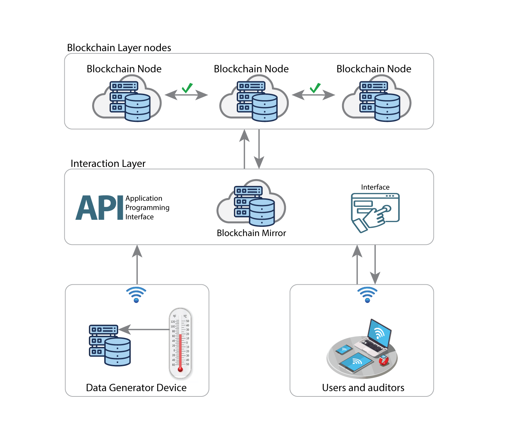

# CONTRUST
## Digital Construction Enhanced by Blockchain

Contrust is a open source project created to enhance digital construction auditability. It could be used to any kind of IoT system, mainly that related to construction.

## Architecture

## Frameworks Used

1. [Node.JS](https://nodejs.org/en/)

2. [Socket.io](https://socket.io/)

3. [Express](https://expressjs.com/)

4. [PM2 Runtime](https://pm2.io/runtime/)

5. [Nuxt.js](https://nuxtjs.org/)

## Start-Up

1. Run `yarn install` or `npm install`

2. Run `yarn start` or `npm start`
